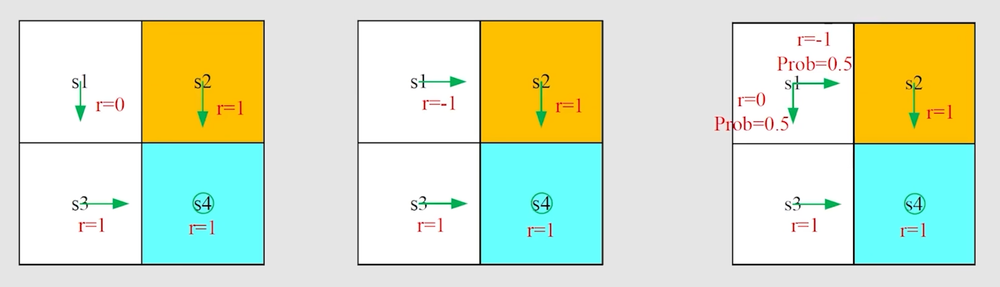
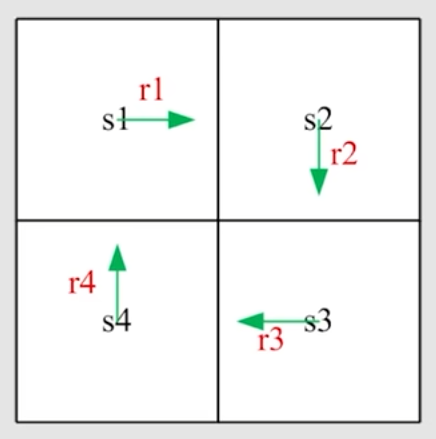
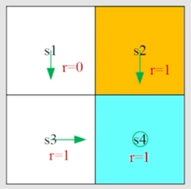
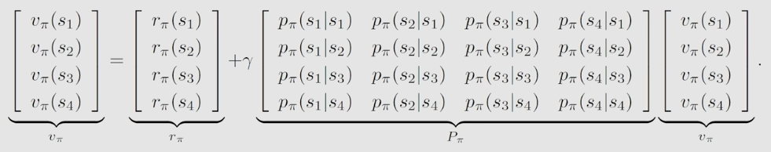

# 贝尔曼公式(Bellman Equation)

## examples

#### 根据策略1 (左图)，从s1开始，折扣回报为

$$
\begin{aligned}
return_1 &= 0 + \gamma1 + \gamma^21 + \ldots,\\
		 &= \gamma(1 + \gamma + \gamma_2 + \ldots),\\
		 &= \frac{\gamma}{1-\gamma}
\end{aligned}
$$

#### 根据策略2 (中图)，从s1开始，折扣回报为

$$
\begin{aligned}
return_2 &= -1 + \gamma1 + \gamma^21 + \ldots,\\
		 &= -1 + \gamma(1 + \gamma + \gamma_2 + \ldots),\\
		 &= -1 + \frac{\gamma}{1-\gamma}
\end{aligned}
$$

#### 根据策略3(右图)，从s1开始，折扣回报为

$$
\begin{aligned}
return_3 &= 0.5(\frac{\gamma}{1-\gamma}) + 0.5(-1 + \frac{\gamma}{1-\gamma})\\
		 &= -0.5 + \frac{\gamma}{1-\gamma}
\end{aligned}
$$

#### 在$s_1$状态，

$$
return_1 > return_3 > return_2
$$

### 如何计算？

#### 方法2

$$
v_1 = r_1 + \gamma(r_2 + \gamma r_3 + \ldots) = r_1 + \gamma v_2 \\
v_2 = r_2 + \gamma(r_3 + \gamma r_4 + \ldots) = r_2 + \gamma v_3 \\
v_3 = r_3 + \gamma(r_4 + \gamma r_1 + \ldots) = r_3 + \gamma v_4 \\
v_4 = r_4 + \gamma(r_1 + \gamma r_2 + \ldots) = r_4 + \gamma v_1
$$

- The returns rely on each other *Bootstrapping!*

$$
\underbrace{\begin{bmatrix}v_1\\v_2\\v_3\\v_4\end{bmatrix}}_v 
= \begin{bmatrix}r_1\\r_2\\r_3\\r_4\end{bmatrix}
+ \begin{bmatrix}\gamma v_1\\\gamma v_2\\\gamma v_3\\\gamma v_4\end{bmatrix}
= \underbrace{\begin{bmatrix}r_1\\r_2\\r_3\\r_4\end{bmatrix}}_r
+ \gamma 
\underbrace{\begin{bmatrix}0 & 1 & 0 & 0\\
			   0 & 0 & 1 & 0\\
			   0 & 0 & 0 & 1\\
			   1 & 0 & 0 & 0\\
\end{bmatrix}}_P \ 
\underbrace{\begin{bmatrix}v_1\\v_2\\v_3\\v_4\end{bmatrix}}_v
$$

**可以写成**
$$
\pmb{v} = \pmb{r} + \gamma \pmb{Pv}
$$
This is the Bellman equation

## State Value

### 考虑下列单步过程

$$
S_t \mathop{\to} \limits^{A_t} R_{t+1}, S_{t+1}
$$

- $ t, t+1:$ 离散时间
- $S_t:$ 在时间 $t$ 的状态
- $A_t:$ 在状态 $S_t$ 下采取的行动
- $R_{t+1}:$ 采取行动 $A_t$ 后获得的奖励
- $S_{t+1}:$ 采取行动  $A_t$ 后转移到的状态

所有$S_t, A_t, R_{t+1}$ 都为随机变量

所有步骤都由下列概率分布所决定：

- $S_t \to A_t$ is governed by $\pi(A_t = a|S_t = s)$
- $S_t, A_t \to R_{t+1}$ is governed by $p(R_{t+1} = r|S_t = s,A_t = a)$
- $S_t, A_t \to S_{t+1}$ is governed by $p(S_{t+1} = s'|S_t = s,A_t = a)$

### 考虑下列多步trajectory：

$$
S_t \stackrel{A_t}{\to} R_{t+1}, S_{t+1}\stackrel{A_{t+1}}{\to} R_{t+2}, S_{t+2}\stackrel{A_{t+2}}{\to} R_{t+3},\ldots
$$

折扣回报：
$$
G_t = R_{t+1} + \gamma R_{t+2} + \gamma^2 R_{t+3} + \ldots
$$

- $\gamma \in [0,1)$ 为回报率
- $G_t$ 是来自随机变量$R_{t+1}, R_{t+2}, \ldots $ 的随机变量

### state-value function 或者简单地 state value,被定义为$G_t$ 的期望（或者称 期望值 or 平均值）

$$
v_\pi(s) = \mathbb{E}[G_t|S_t = s]
$$

$G_t$ 可以化为：
$$
\begin{aligned}
G_t &= R_{t+1} + \gamma R_{t+2} + \gamma^2 R_{t+3} + \ldots, \\
    &= R_{t+1} + \gamma (R_{t+2} + \gamma R_{t+3} + \ldots), \\
    &= R_{t+1} + \gamma G{t+1}
\end{aligned}
$$
那么，state value可以定义为
$$
\begin{aligned}
v_\pi(s) &= \mathbb{E}[G_t|S_t = s] \\
		 &= \mathbb{E}[R_{t+1} + \gamma G_{t+1}|S_t = s] \\
		 &= \mathbb{E}[R_{t+1}|S_t = s] + \gamma \mathbb{E}[G_{t+1}|s_t = s]
\end{aligned}
$$
首先计算第一项 $\mathbb{E}[R_{t+1}|S_t = s]$ :
$$
\begin{aligned}
\mathbb{E}[R_{t+1}|S_t = s] &= \sum \limits_a \pi(a|s) \mathbb{E}[R_{t+1} | s_t = s, A_t = a]\\
							&= \sum \limits_a \pi(a|s) \sum \limits_r p(r|s,a)r
\end{aligned}
$$
即 *immediate rewards* 的均值

计算第二项$\mathbb{E}[G_{t+1}|s_t = s]$
$$
\begin{aligned}
\mathbb{E}[G_{t+1}|s_t = s] &= \sum \limits_{s'} \mathbb{E}[G_{t+1}|S_t = s, S_{t+1} = s']p(s'|s) \\
							&= \sum \limits_{s'} \mathbb{E}[G_{t+1}|S_{t+1} = s']p(s'|s) \\
							&= \sum \limits_{s'} v_{\pi}(s')p(s'|s) \\
							&= \sum \limits_{s'} v_{\pi}(s')\sum \limits_a p(s'|s, a) \pi(a|s)
\end{aligned}
$$
即 *future rewards* 的均值

最后
$$
\begin{aligned}
v_\pi(s) &= \mathbb{E}[R_{t+1}|S_t = s] + \gamma \mathbb{E}[G_{t+1}|s_t = s], \\
		 &= \underbrace{\sum \limits_a \pi(a|s) \sum \limits_r p(r|s,a)r}_{mean\ of\ immidiate\ rewards}
		 + \underbrace{\gamma \sum \limits_a \pi(a|s) \sum \limits_{s'} p(s'|s,a) v_{\pi}(s')}_{mean\ of\ future\ rewards}, \\
		 &= \sum \limits_a \pi(a|s) [\sum \limits_r p(r|s, a)r + \gamma \sum \limits_{s'}p(s'|s, a)v_{\pi}(s')], \quad \forall s \in S.
\end{aligned}
$$

### example

写出贝尔曼公式：
$$
v_{\pi}(s)= \sum \limits_a \pi(a|s) [\sum \limits_r p(r|s, a)r + \gamma \sum \limits_{s'}p(s'|s, a)v_{\pi}(s')]
$$
首先，考虑 $s_1$ 的state value：

- $\pi(a = a_3|s_1) = 1 \ and\ \pi(a\ne a_3|s_1) = 0.$
-  $p(s' = s_3|s_1, a_3) = 1 \ and \ p(s' \ne s_3|s_1, a_3) = 0.$
- $p(r = 0|s_1, a_3) = 1 \ and \ p(r \ne 0|s_1, a_3) = 0.$

带入贝尔曼公式：
$$
v_{\pi}(s_1) = 0 + \gamma v_{\pi}(s_3)
$$
那么，可以得到：
$$
v_{\pi}(s_1) = 0 + \gamma v_{\pi}(s_3) \\
v_{\pi}(s_2) = 1 + \gamma v_{\pi}(s_4)\\
v_{\pi}(s_3) = 1 + \gamma v_{\pi}(s_4)\\
v_{\pi}(s_4) = 1 + \gamma v_{\pi}(s_4)
$$
解得：
$$
v_{\pi}(s_4) = \frac{1}{1-\gamma}, \\
v_{\pi}(s_3) = \frac{1}{1-\gamma}, \\
v_{\pi}(s_2) = \frac{1}{1-\gamma}, \\
v_{\pi}(s_1) = \frac{\gamma}{1-\gamma}.
$$
if  $\gamma = 0.9$, then
$$
v_{\pi}(s_4) = \frac{1}{1-0.9} = 10, \\
v_{\pi}(s_3) = \frac{1}{1-0.9} = 10, \\
v_{\pi}(s_2) = \frac{1}{1-0.9} = 10, \\
v_{\pi}(s_1) = \frac{0.9}{1-0.9} = 9.
$$

## 公式向量形式与求解

贝尔曼公式：
$$
v_{\pi}(s)= \sum \limits_a \pi(a|s) [\sum \limits_r p(r|s, a)r + \gamma \sum \limits_{s'}p(s'|s, a)v_{\pi}(s')]
$$
重写：
$$
v_{\pi}(s) = r_{\pi}(s) + \gamma \sum \limits_{s'}p_{\pi}(s'|s)v_{\pi}(s') \tag{1}
$$
where
$$
r_{\pi}(s) \stackrel{\Delta}{=} \sum \limits_a \pi(a|s)\sum \limits_r p(r|s, a)r, \qquad p_{\pi}(s'|s) \stackrel{\Delta}{=} \sum \limits_a \pi(a|s)p(s'|s,a)
$$

状态写成 $s_i(i=1,\ldots,n).$

对于状态$s_i$ 贝尔曼公式为：
$$
v_{\pi} = r_{\pi} + \gamma P_{\pi} v_{\pi}
$$
where

- $v_{\pi} = [v_{\pi}(s_1), \ldots, v_{\pi}(s_n)]^T \in \mathbb{R}^n$
- $r_{\pi} = [r_{\pi}(s_1), \ldots, r_{\pi}(s_n)]^T \in \mathbb{R}^n$
- $P_{\pi} \in \mathbb{R}^{n \times n}$, where $[P_{\pi}]_{ij} = p_{\pi}(s_j|s_i)$, 为状态转移矩阵

- 解：
  $$
  v_{\pi} = (I-\gamma P_{\pi})^{-1}r_{\pi}
  $$
  求逆较为复杂，使用迭代法

- 迭代法:
  $$
  v_{k+1} = r_{\pi} + \gamma P_{\pi}v_k
  $$
  算法获得序列 $\{v_0, v_1, v_2, \ldots\}$
  $$
  v_k \to v_{\pi} = (I-\gamma P_{\pi})^{-1}r_{\pi}, \qquad k \to \infty
  $$
  

## Action value

定义：
$$
q_{\pi}(s, a) = \mathbb{E}[G_t|S_t = s, A_t = a]
$$

- $q_{\pi}(s,a)$ 是状态动作对 $(s, a)$ 的函数
- $q_{\pi}(s, a)$ 依赖于 $\pi$

根据条件期望：
$$
\underbrace{\mathbb{E}[G_t|S_t = s]}_{v_{\pi}(s)} = \sum \limits_a \underbrace{\mathbb{E}[G_t|S_t = s, A_t = a]}_{q_{\pi}(s, a)} \pi(a|s)
$$
Hence,
$$
v_{\pi}(s) = \sum \limits_a \pi(a|s)q_{\pi}(s,a) \tag{2}
$$
state value:
$$
v_{\pi}(s) = \sum \limits_a \pi(a|s)[\underbrace{\sum \limits_r p(r|s,a)r + \gamma\sum \limits_{s'}p(s'|s,a)v_{\pi}(s')}_{q_{\pi}(s,a)}] \tag{3}
$$
比较$(2)\ and\ (3)$，可以得到 **action-value funciton** as
$$
q_{\pi}(s,a) = \sum \limits_r p(r|s,a)r + \gamma \sum \limits_{s'} p(s'|s,a)v_{\pi}(s') \tag{4}
$$

## Summary

- **State value:** $ v_{\pi}(s) = \mathbb{E}[G_t|S_t = s]$

- **Action value:** $q_{\pi}(s,a) = \mathbb{E}[G_t|S_t = s,A_t = a]$

- **The Bellman equation(elementwise form):**
  $$
  \begin{aligned}
  v_{\pi}(s) &= \sum \limits_a \pi(a|s)[\underbrace{\sum \limits_r p(r|s,a)r + \gamma \sum \limits_{s'}p(s'|s,a)v_{\pi}(s')}_{q_{\pi}(s,a)}] \\
  		   &= \sum \limits_a \pi(a|s)q_{\pi}(s,a)
  \end{aligned}
  $$
  

- **The Bellman equation(matrix-vector form):**
  $$
  v_{\pi} = r_{\pi} + \gamma P_{\pi}v_{\pi}
  $$

- How to solve the Bellman equation: **closed-form solution** , **iterative solution**
