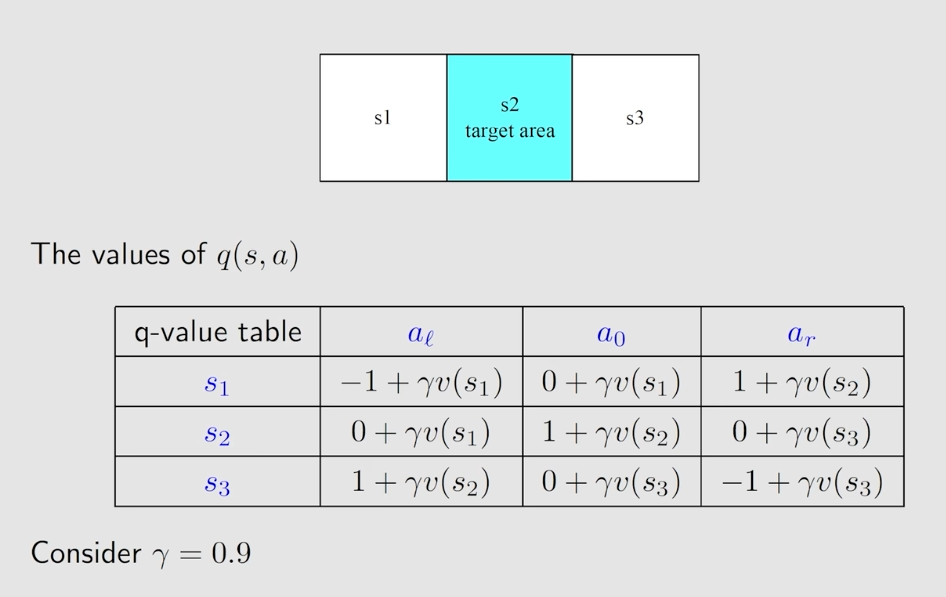
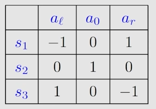

# Optimal Policy and Bellman Optimality Equation

## Optimal policy

state value 可以被用来评估策略的好坏：if
$$
v_{\pi_1}(s) \geq v_{\pi_2}(s) \qquad s \in S
$$
then $\pi_1$ is "优于" than $\pi_2$

**Definition**

一个策略 $\pi^*$ 如果在状态 $s$ 下对于其他所有策略 $\pi$ 都有 $v_{\pi^*}(s) \geq v_{\pi}(s)$ 那么它就是最优的

- 最优策略是否存在？
- 最优策略是唯一的吗？
- 最优策略是确定性的还是不确定性的？
- 如何得到最优策略？、

## Bellman Optimality Equation(BOE)

**Bellman optimality equation (elementwise form):**
$$
\begin{aligned}
v(s) &= \max_{\pi} \sum \limits_a \pi(a|s) \Bigg( \sum \limits_r p(r|s,a)r + \gamma \sum \limits_{s'} p(s'|s,a)v(s') \Bigg), \quad \forall s \in S \\
	 &= \max_{\pi} \sum \limits_a \pi(a|s) q(s,a) \quad s \in S
\end{aligned}
$$
**Remarks:**

-  $ p(r|s,a), p(s'|s,a)$ are known.
- $ v(s), v(s') $ are known and to be calculated.
- Is $ \pi(s) $ known or unknown?

**Bellman optimality equation (matrix-vector form):**
$$
v = \max_{\pi} (r_{\pi} + \gamma P_{\pi}v)
$$
**BOE的收缩特性**
$$
v = f(v) = \max_{\pi}(r_{\pi}+\gamma P_{\pi}v)
$$
**不动点迭代**算法：

Matrix-vector form：
$$
v_{k+1} = f(v_{k}) = \max_{\pi}(r_{\pi}+\gamma P_{\pi}v_k)
$$
Elementwise form:
$$
\begin{aligned}
v_{k+1}(s) &= \max_{\pi}\sum \limits_a \pi(a|s) \Bigg( \sum \limits_r p(r|s,a)r + \gamma \sum \limits_{s'} p(s'|s,a)v_k(s') \Bigg) \\
		   &= \max_{\pi} \sum \limits_a \pi(a|s)q_k(s,a) \\
		   &= \max_a q_k(s,a)
\end{aligned}
$$

**Example**

$ k =0 $:

v-value: select $v_0(s_1) = v_0(s_2) = v_0(s_3) = 0$

q-value(using the previous table):

Greedy policy(select the greatest q-value)
$$
\pi(a_r|s_1) = 1, \quad \pi(a_0|s_2) = 1, \quad \pi(a_l|s_3) = 1
$$
v-value: $v_1(s) = \max_a q_0(s,a)$
$$
v_1(s_1) = v_1(s_2) = v_1(s_3) = 1
$$

## Analyzing optimal policies

